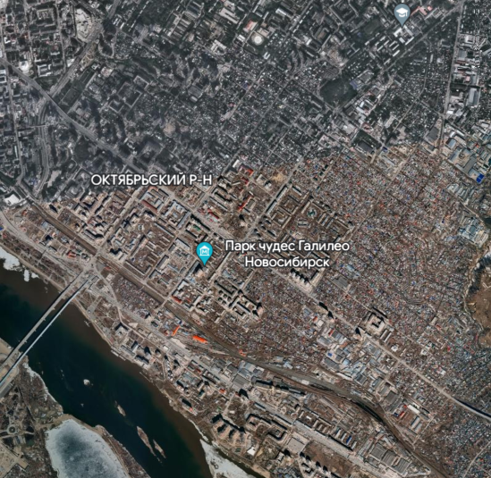

## Point A (Левая верхняя)
### lat = 55.030377, lon = 82.924486;
## Point B (Правая нижняя)
### lat = 54.992544, lon = 82.992803;

## Регион

### Преобразование координат в lat, lon (при условии что карта расположена на сфере)

### lat = asin(z / R)
### lon = atan2(y, x)

### Обратное преобразование

### x = R * cos(lat) * cos(lon) 
### y = R * cos(lat) * sin(lon) 
### z = R * sin(lat)

